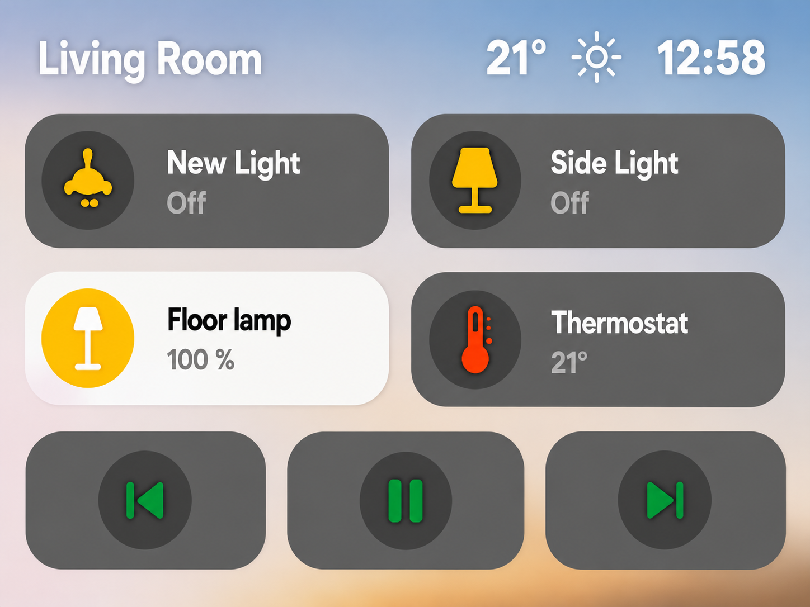
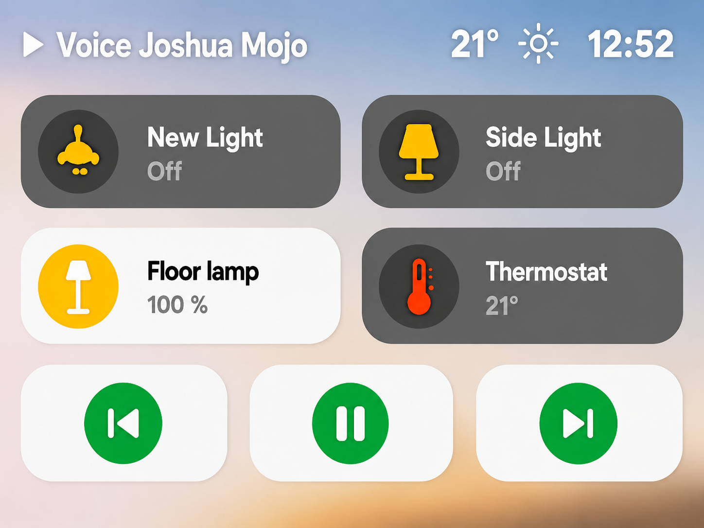

# Home Assistant ESP32 (CYD) dashboard

This project is based on [akuehlewind/ESPHome-touch-display-mount](https://github.com/akuehlewind/ESPHome-touch-display-mount) and the great work he made there.

ESPHome configuration for a Cheap Yellow Display (ESP32-2432S028) with an LVGL smart-home dashboard.

  
  

## Features
- 2x2 control tiles with tap and optional long-press slider controls
- Media control row (previous, play/pause, next)
- Header with room name (changed to playing track when playing), weather icon + temperature, and clock
- Auto-dim and night dim behavior
- Presence-based screen blanking to reduce electricity consumption and reduce the chance of pixel burn.

## Project Structure
- `dashboard.yaml`: main config (system + hardware + package includes)
- `config.yaml.example`: template for `config.yaml` containing substitutions and user-facing settings
- `secrets.yaml.example`: template for `secrets.yaml` containing local credentials file
- `sensors.yaml`: sensor, binary_sensor, text_sensor
- `lvgl.yaml`: fonts, image, and LVGL UI
- `scripts.yaml`: all automation and UI logic scripts
- `fonts`: containing required font binaries
- `images`: containing background image

## Requirements
- ESPHome (CLI)
- Home Assistant API integration
- CYD-compatible hardware wiring

## Quick Start
1. Copy `secrets.yaml.example` to `secrets.yaml` and fill in values.
2. Copy `config.yaml.example` to `config.yaml`.
3. Update entities and display settings in `config.yaml`.
4. Validate config:
   - `esphome config dashboard.yaml`
5. Flash or OTA upload:
   - `esphome run dashboard.yaml`

## Notes
- `secrets.yaml` is intentionally gitignored.
- Validate from `dashboard.yaml` (split files are package fragments).

## License
MIT. See `LICENSE`.
